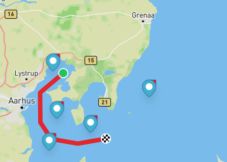
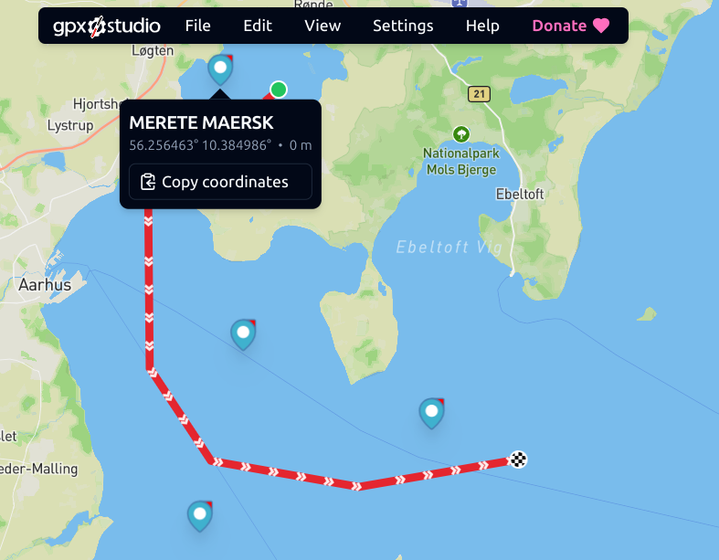
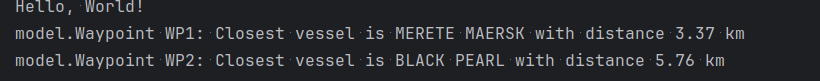

## Introduction
This project finds the closest vessel (ship) to each of two waypoints using Java. 

## Problem Description
The task is to calculate the distance from each of two waypoints (from a GPX file, `Route.gpx`) to a list of vessels and identify the closest vessel for each waypoint. 
- "Waypoint WP1: Closest vessel is [ship name] with distance [distance] km"
- "Waypoint WP2: Closest vessel is [ship name] with distance [distance] km"

### Given Data
- **Waypoints** (from `Route.gpx`):
   - **Initial Approximation** (I did not know how to extract the waypoints or names, ):
      - WP1: (56.258029, 10.439546)
      - WP2: (56.045770, 10.673637)
   - **Accurate Coordinates** (later extracted by viewing `Route.gpx` ):
      - WP1: (56.255625, 10.442260)
      - WP2: (56.054509, 10.676264)
- **Vessels** (from `Vessels.xml`):
   - MERETE MAERSK: (56.256463, 10.384986)
   - KANPUR: (56.112223, 10.407222)
   - RMS TITANIC: (56.013356, 10.365090)
   - BLACK PEARL: (56.069476, 10.591058)
   - BOATY MCBOATFACE: (56.177454, 10.913075)

## Approach
### Understanding the Problem
To solve this, I needed to:
1. Calculate distances from each waypoint to all vessels.
2. Identify the vessel with the shortest distance for each waypoint.
3. Output the results in kilometers, rounded to two decimal places.

As a visual human, I have used https://gpx.studio/ to try to visualise the vessels and the waypoints


### Research and Key Decisions
1. **Distance Calculation**:
   - Researched using online resources and AI tools (e.g., ChatGPT) and chose the Haversine formula to calculate the great-circle distance on Earth’s curved surface.
   - Haversine converts latitude/longitude to radians, uses sine/cosine for curvature, and multiplies by Earth’s radius (6,371 km).
   - Considered Vincenty’s formula (more accurate, uses Earth’s ellipsoid shape) but decided against it because:
      - It’s slower due to iterative calculations.
      - The waypoints and vessels are close (within 30 km), so Haversine’s accuracy (error < 100 meters) is enough.
      - Simplicity and readability are prioritized, and Haversine is easier to understand.
2. **Graph Theory**:
   - Modeled the problem as a graph:
      - **Nodes**: Waypoints (WP1, WP2) and vessels (5 ships).
      - **Edges**: Connections between each waypoint and every vessel.
      - **Weights**: Distances calculated by Haversine.
   - This visualization helped me structure the solution: loop through waypoints, compute distances to vessels, and select the minimum distance.
3. **Performance Optimization**:
   - Implemented a 0.5-degree bounding box heuristic to skip vessels far from a waypoint (e.g., >55 km north/south or ~30 km east/west).
   - Checks if a vessel’s latitude/longitude is within ±0.5° of the waypoint’s before calculating the Haversine distance.
   - With 5 vessels, all are within the box, but this heuristic ensures scalability for larger datasets (e.g., 1,000 vessels).
4. **Waypoint Handling**:
   - Initially struggled to open `Route.gpx`, so I approximated coordinates by viewing the file on my phone, then on an gpx studio.
   - Hardcoded both sets of coordinates in the code to test results, as I lacked time to learn GPX parsing.
5. **Programming Language**:
   - Chose Java because :
      - Easier for me and lower learning curve and I can focus on understanding the problem rather than dealing with new syntax and so on.
   - Avoided C++ due to:
      - Steeper learning curve (e.g., manual memory management, new syntax, etc).
      - Need for libraries like pugixml for XML parsing.
      - Time constraints and prioritization of understanding over performance.
6. **Libraries**:
   - Researched libraries like GeoTools, JTS Topology Suite, and KD-tree for geospatial calculations, and gpx-parser for GPX files.
   - Decided against libraries because:
      - Limited time to learn and integrate them.
      - Small problem size (2 waypoints, 5 vessels) didn’t require advanced features.
      - Java’s built-in XML parser and custom Haversine were sufficient and simpler.

## Solution
The solution is implemented in Java with an object-oriented design for clarity and maintainability:
- **Classes**:
   - `Point`: Stores latitude and longitude coordinates.
   - `Vessel`: Represents a ship with a name and location.
   - `Waypoint`: Represents a waypoint with a name and location.
   - `DistanceCalculator`: Computes Haversine distances and applies the 0.5-degree heuristic.
   - `VesselCollection`: Parses `Vessels.xml` using Java’s built-in XML parser.
   - `RouteAnalyzer`: Manages waypoints, finds the closest vessel for each, and prints results.


## Results

   - WP1: (56.255625, 10.442260)
   - WP2: (56.054509, 10.676264)
   - Output:
     ```
     Waypoint WP1: Closest vessel is MERETE MAERSK with distance 3.54 km
     Waypoint WP2: Closest vessel is BLACK PEARL with distance 5.55 km
     ```
### Visual Results



## Reflections
### What I Learned
- Haversine formula
- Calculating distances apparently require factoring in earth's curvature (not something I really ever ha the need to think about)
- Improvising on many things just to get the ball rolling; Things like opening the file, approximating the coordinates, etc.
- Deciding what  trade-offs to make (e.g., no libraries, Java over C++) to balance time constraints, simplicity, and functionality.

## Conclusion
Interesting and very new challenge for me. The first time reading the problem, it made very little sense and I was not familiar with the file format.
Overall it was a valuable learning experience.

