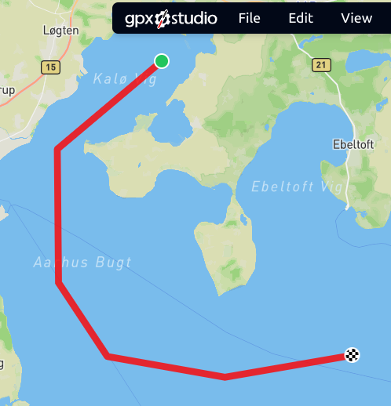

# VessleDistancing

Route with two specific point(way point) near Kalø Vig in Denmark.

I'm approximating(more like eyeballing) the waypoints to:
Waypoint 1: (56.258029, 10.439546)
Waypoint 2: (56.045770, 10.673637)

Just did it this way because I did not know how to open the GPX file on linux, tried with my phone and and got the approximate coordinates.
I have read that the GPX file should include names, but I'm ignoring that now.

Because I'm a visual person, I had to visualise things so it would help me understand better.

# My understanding of the task:
1. _we have 2 waypoints, their coordinates and names (although I did not get the names)_
   Waypoint 1: (56.258029, 10.439546)
   Waypoint 2: (56.045770, 10.673637)

2. _We have a list of vessels and their coordinates_
   Vessel[name=MERETE MAERSK, latitude=56.25646346665703, longitude=10.384985569490757]
   Vessel[name=KANPUR, latitude=56.112222867603656, longitude=10.407221794383409]
   Vessel[name=RMS TITANIC, latitude=56.01335602421017, longitude=10.365089999849966]
   Vessel[name=BLACK PEARL, latitude=56.06947605204449, longitude=10.59105827202736]
   Vessel[name=BOATY MCBOATFACE, latitude=56.17745369462793, longitude=10.91307527877345]

_The task is to find which  ship is closest to each waypoint by calculating the distance from each of the waypoint to each of the vessels._
So in the end I should log to the console something like:
“Waypoint WP1: Closest ship is [ship name] with distance [distance] km”
“Waypoint WP2: Closest ship is [ship name] with distance [distance] km”

After a bit of googling and ChatGPT, it seems I need:
1. to use Haversine fomular to calculate the distance.
   The reason being the earth isn't flat so we need to find the curved distance known as great-circle distance.
2. Convert the lat and long from degrees to radians (because the formular uses radians)
   This formular examines the distance in latitude and longitude, then uses sine and cosine to account for earth's curvature
3. Multiply all that by Earth's Radius which is 6,378 km (dunno what measuring tape managed that but cool)
4. Will use graph theory to "map" out the idea that nodes are waypoints and ships
   Edges are the connections between waypoints and shops
   Distances are weights that represetn how long connection is

What I'm not using
Not using Vincenty's formular even if more accurate as it slower since it involves iterative calculations. 
It is also unnecessary since the distances are so close to each other and not over thousands of kilometers. 
Also keeping in mind that the use case does not demand high precision
This was also much simpler for me to understand in the small time frame I gave myself

Did not consider using libraries for the calculation or parsing as did not have time to investigate this at all
Internet search showed I could use GeoTools, KD-tree or JTS lib in java.
Also using a parser for the GPX file instead of how I manually did it and hardcoded the values.
Did not implement this in c++ as it would be a much higher learning curve for the time restraint
Java was easier so  I could just focus on understanding the problem and trying to work with such a 
new concept to me.

Ok after a while I found how to get the coordinate
56.255625, 10.442260
56.054509, 10.676264

Result

